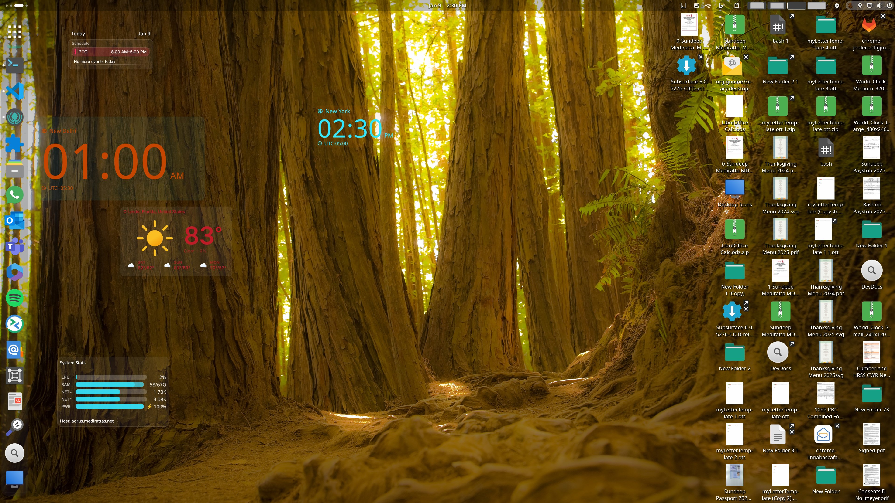
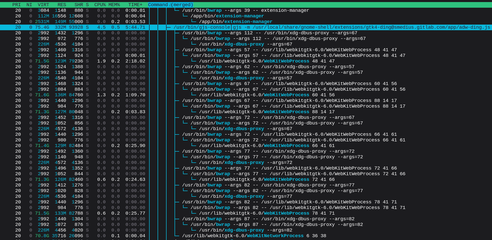

# Desktop Widgets

<p align="center">
  
</p>

## Why I wanted to do this

On many modern Linux desktops, the desktop itself is often under-utilized. Large areas of prime screen real estate sit empty, while useful information is hidden behind panels, menus, or full applications. I wanted to use that space better.

I’ve always liked desktop widgets on other operating systems and Linux distributions, especially on **Solus** and **Budgie**, where widgets feel like a natural part of the desktop rather than an afterthought. Similar ideas exist elsewhere as well, such as **KDE Plasma’s plasmoids**, and various widget or desklet systems found across different desktops and platforms.

I wanted to bring a comparable, first-class widget experience to the GNOME desktop, so that it feels on par with other environments while still respecting GNOME’s design principles and focus on simplicity.

At the same time, this project recognizes that not every user wants the same desktop experience. While GNOME designers may prefer a more minimal or opinionated approach, widgets are a valid and useful option for users who want persistent, glanceable information on their desktop. This project exists to fill that niche for people who want widgets on GNOME, without forcing that model on anyone else. They are completely optional and opt-in.

It is important to note that this is an independent application, even though it integrates with GNOME through an extension. The extension provides the necessary hooks into the desktop, but the widget system itself runs separately and follows its own design and stability constraints.

Widgets are meant to be:
- lightweight
- glanceable
- always available
- visually integrated with the desktop

They are **not** meant to be full applications. They are primarily for displaying information at a glance, such as:

- time and date
- weather and forecasts
- system status and resource usage (CPU, memory, network)
- calendars and upcoming events
- reminders and notes
- photos and image feeds
- remote camera or doorbell snapshots
- Data from your raspberry pi project or camera :-);
- dashboards from systems like Cockpit or Grafana
- asset or device status indicators
- lightweight IT or infrastructure status displays
- Stocks, scores, RSS feeds etc

Widgets are intended to present information clearly and passively. While limited interaction (such as opening preferences or refreshing data) is expected, widgets should avoid complex workflows or application-like behavior.

I also wanted to take advantage of powerful modern web technologies. HTML, CSS, and JavaScript make it easy to build rich visual layouts quickly, while still keeping development approachable.

Using HTML also makes it possible to leverage the enormous existing web ecosystem instead of reinventing everything from scratch. Widget authors can reuse proven web technologies, patterns, and tooling that already exist and are well understood, while also taking advantage of rich web connectivity to gather and display information from other computers, servers, appliances, and networked services.

This makes it easy to build widgets that integrate with home automation systems, monitoring endpoints, remote dashboards, infrastructure services, and other devices that already expose web-based APIs or interfaces.

When HTTP APIs are not enough, widgets can declare a native backend helper. The helper is launched directly from the widget directory and communicates with the HTML UI using newline-delimited JSON. This unlocks integrations with sensors, CLI tools, and custom daemons written in any language, so long as you ship the executable with the widget. Because the helper runs with the user’s privileges, treat it like any other desktop application when reviewing or distributing widgets.

This includes:
- modern JavaScript frameworks and libraries
- React, Vue, Svelte, or plain JavaScript
- build pipelines using Node.js and existing web tooling
- established visualization libraries for charts, graphs, and dashboards
- mature techniques for layout, theming, and accessibility
- WASM and other emerging technologies if and when WebKit supports it

Many useful widgets already exist in web form: dashboards, monitoring panels, calendars, charts, and status displays. In many cases, these can be adapted directly into desktop widgets with minimal changes, rather than rewritten as native applications.

In practice, this can be as simple as taking an existing web project and using a standard Node-based build step to produce a static bundle (HTML, CSS, JavaScript, and assets). Once built, you place the output files into a widget folder, add a widget.json manifest, and you effectively have a desktop widget.

The workflow looks like this:

- build your web UI with whatever tooling you like (React/Vue/Svelte/plain JS)
- run a build step to produce static files (a typical “dist/” output)
- copy those files into a widget directory
- ensure the entry point is index.html
- add widget.json with an id, default size, and optional metadata

At that point, the widget can be discovered and loaded by the platform without needing to rewrite it as a native GNOME application.

This approach allows widget authors to rely on proven technologies, documented APIs, and real-world examples, while still delivering experiences that feel at home on the GNOME desktop. The intent is not to turn the desktop into a web browser, but to reuse the best parts of the web ecosystem in a controlled and desktop-friendly way with rapid development and prototyping possible.

This project exists to combine:
- the simplicity and usefulness of classic desktop widgets
- the flexibility of modern web UI
- proper desktop integration
- a security model that is defensive by default, but, there is nothing like "Absolute Security"

<p align="center">
  
  <br>
  <span>Demonstrates WebKit subprocesses, bwrap sandboxing, and multiprocessing architecture</span>
</p>

From a runtime perspective, HTML widgets are executed using WebKit, with rendering and JavaScript execution handled in separate WebKit subprocesses, rather than inside the main desktop process or GNOME Shell. Widgets share a common WebKit WebContext, with each widget running in its own WebView, much like tabs in a web browser. Each widget ultimately runs as a subprocess of the ding application, not inside the GNOME Shell main loop.

The WebKit subprocesses are owned by the ding application, not by GNOME Shell, and widget code never executes inside the GNOME Shell main loop. This separation ensures that misbehaving widgets cannot block or crash the desktop itself. While widgets share WebKit infrastructure, failures are contained to the widget or WebKit subprocess, not the desktop. This separation is intentional and fundamental to the design. As a result:

- a crashing widget should not crash GNOME Shell
- a misbehaving widget should not block desktop rendering or input
- freezes or stalls are isolated to the widget itself
- the desktop remains responsive even if one or more widgets fail

WebKit’s multi-process architecture, combined with the platform’s sandboxing and resource confinement, allows widgets to take advantage of modern web technologies while keeping failures contained. If a widget crashes or becomes unresponsive, it affects only that widget, instead of the desktop environment.

Looking ahead, this architecture opens up even more powerful possibilities. One future direction is to make the widget runtime D-Bus activatable and managed as a user-level systemd service, rather than a simple child process. This would allow the widget system to run in its own cgroup, with explicit limits on CPU usage, memory consumption, and other resources.

Running widgets under systemd with resource constraints would make it possible to:

- enforce hard limits on misbehaving widgets
- prioritize desktop responsiveness over widget activity
- cleanly restart the widget runtime without restarting the desktop
- integrate more naturally with modern Linux process management

This kind of design treats widgets not as fragile extensions, but as contained, well-behaved user processes. It provides strong isolation without pretending to offer absolute security, and it aligns well with modern Linux desktop and system architecture.

Overall, this approach strikes a pragmatic balance: it enables powerful, flexible widgets built with existing web technologies, while still respecting the stability, robustness, and reliability expectations of a desktop platform.

---

## What this is

This is a **desktop widget platform** built directly into the desktop environment.

Widgets:

- live directly under the desktop icon layer.
- can be moved and selected
- preserve their Z-order relative to each other; stacking is persisted and restored across sessions.
- the last added widget starts on top; clicking a widget brings it to the top of the stack.
- can be configured (when preferences are provided)
- are discovered automatically
- run in a shared WebKit runtime with program-defined CSP profiles (see enums) and are isolated as much as reasonably possible. 
- The behaviour matches browserr semantics. WebKit enforces browser-like CORS rules.
- Widgets can freely consume CORS-enabled APIs (weather, JSON REST services, etc.).
- Widgets cannot bypass server-defined security restriction

In normal operation, desktop icons are always on top of widgets and can be freely moved over them. This ensures that widgets never interfere with standard icon interaction or file management.

My personal design philosophy for widgets is that they should be small, clean, and visually restrained. They should not occupy the entire desktop or dominate the user’s workspace. Instead, widgets are meant to live quietly in a corner or in unused areas of the desktop, away from icons when possible, while still allowing the user to position them anywhere they choose.

By default, widgets are designed to use a transparent background, so the underlying desktop remains visible and the widget feels like a natural part of the environment rather than a floating window. Widget authors are free to apply any background they want, but the guiding idea is that the desktop should still show through the widget whenever possible.

The goal is subtlety: widgets should complement the desktop, not cover it.

When editing widgets (positioning, selection, or opening preferences), the widget layer is temporarily raised above the icon layer. This allows widgets to be selected, moved, and configured without obstruction.

At the moment, the widget layer cannot be toggled off entirely, however if no widgets are installed, none are shown and no needless resources are used by the app, all resource loading is lazy, only if a widget is installed. The layering change is only used to enable editing and configuration, and the widget layer is returned beneath the icon layer during normal use.

This design keeps widgets unobtrusive during everyday use while still allowing direct interaction when needed.


**Widgets cannot be resized by design**

This is intentional: widgets are meant to render correctly at a known size. Allowing arbitrary resizing often leads to broken layouts, unreadable text, and inconsistent visual quality. Instead, widget authors are encouraged to design widgets for specific sizes and, if needed, ship multiple size variants of the same widget.

One size does not fit all desktops or resolutions, and this approach keeps rendering predictable while still allowing flexibility through multiple widget variants.

Most widgets are HTML-based and rendered using WebKit. The platform is structured so that widget discovery, lifecycle, and isolation are not tightly coupled to the rendering technology. While only HTML widgets are supported today, the plumbing is designed to allow GTK-based widgets in the future.

Widgets that support floating or pinned behavior should also be designed to survive a page reload. Moving an HTML widget between the normal desktop container and a floating window can require the host to reload the WebView so WebKit paints correctly after the parent change. Important state should therefore be persisted in config or another durable source, not kept only in transient page memory.

The same rule applies to any widget that enables pinning. If a widget declares `pinnable: true`, it must treat pin, unpin, and pinned edit transitions as reload-safe operations.

---

# Desktop Widgets — Getting Started

Desktop Widgets let you place small, glanceable information panels directly on your GNOME desktop. Widgets live underneath your desktop icons during normal use, and can be temporarily brought to the front when you want to move or configure them.

Widgets are optional and opt-in. If you never install or enable widgets, no additional resources are used.

Currently widgets run as HTML WebViews (like regular web pages) using WebKit and libsoup; if those components are missing, the application still runs normally but widgets and their UI are unavailable. Gtk Widgets are planned in future, but are not implemented yet. 

When present, and enabled, widgets can reach the network like any web page, subject to system/network restrictions with baseline very strict access via CSP (See security section).

### Enabling widgets

Widgets are disabled by default.

1. Open the application preferences.
2. Enable Desktop Widgets.

Once enabled, the widget system becomes available. If no widgets are installed, nothing will appear and no extra resources are used.

### Switching widget layers (edit mode)

Widgets normally sit below desktop icons so they never interfere with file management.

To interact with widgets (move them, select them, or open preferences), the widget layer is temporarily raised above the icon layer.

**Enter widget edit mode**

- Use the Edit Widgets right click menu option on the desktop. A toggle layer shortcut is available in shortcut manger with no default keyboard shortcuts assigned, you can enable your own.

When edit mode is active:

- Widgets are drawn above icons.
- Widgets can be selected and dragged.
- Selection chrome and controls become visible.

**Exit widget edit mode**

- Press Escape, or
- Exit edit mode from the right click menu.
- Toggle shortcut also works.

This lowers the widget layer back under the icons and returns the desktop to normal operation.

### Adding widgets

Once widgets are enabled:

1. Enter widget edit mode.
2. Choose Add Widget from the add widget + button at the bottom.
3. Select a widget from the list.

A new widget instance is created on the current monitor and placed near the center. You can move it anywhere while still in edit mode.

You can add multiple instances of the same widget (for example, multiple clocks or weather widgets), each with its own configuration.

### Moving and selecting widgets

Widgets can only be moved while in edit mode.

- Click a widget to select it.
- Drag to reposition it. Long press starts the drag.

The selected widget is drawn above other widgets. Widget positions and stacking order are saved and restored automatically.

Clicking on a widget raises it above all other widgets. They cannot be raised above the add button, can not obscure it.

However, if add button is where you want to position your widget, it will slide under it. You can allso drag the add button to any position so that it is not on the widget.

### Widget preferences

Some widgets provide preferences.

- If a widget supports preferences, a gear icon appears when the widget is selected and edit mode is active.
- Clicking the gear opens the widget’s preferences window.
- Only one preferences window can be open at a time.
- Preferences close automatically when you exit edit mode or unselect the widget.
- Widgets can open preferences on their own, if they provide UI elements to do so; However the chrome prefrences button is always controlled by the desktop.

### Installing widgets

Widgets are discovered automatically from specific directories. They are discovered at startup.

**User-installed widgets (recommended)**

Install widgets for your user account only:

```
$XDG_DATA_HOME/<app-id>/widgets/
```

Typical path:

```
~/.local/share/<app-id>/widgets/
```

app-id is com.desktop.ding

Each widget lives in its own directory and must contain:

- `widget.json`
- `index.html`

Example:

```
~/.local/share/<app-id>/widgets/clock/
├── widget.json
├── index.html
├── style.css
└── script.js
```

**System-wide widgets**

System packages may install widgets here:

```
$XDG_DATA_DIRS/<app-id>/widgets/
```

User widgets always override system widgets with the same ID.

### Removing widgets

To remove a widget:

1. Delete its directory from the widgets folder.
2. Remove any active instances from the desktop (or restart the session).
3. You can close a widget in edit mode, and leave the directory, it can be added back later.

Removing a widget directory does not affect other widgets.

### Resource usage and safety

Widgets run outside of GNOME Shell and cannot crash the Gnome desktop, only possibly this app. If they do, please let me know :-)

- WebKit is started only when at least one widget is active.
- If no widgets are installed or enabled:
  - no WebKit processes are running
  - no additional attack surface is present

Only install widgets from sources you trust.

### Summary

- Widgets are optional, lightweight, and opt-in
- Use edit mode to interact with widgets
- Press Escape to exit edit mode or rigth click menu
- Install widgets by copying them into the widgets directory
- Widgets are isolated and safe by design, but still run user code and have access to web with a restricted profile for safety

For developers who want to create widgets, see the Author Guide below.

# Author Guide

## What widgets are (and are not)

Widgets are intended to be:
- lightweight
- mostly non-interactive
- informational rather than procedural

They should not:
- replace full applications
- require complex user workflows
- perform sensitive system actions

Small interactions (settings, toggles, refresh buttons) are fine, but widgets should primarily **display information**, not act as full control panels.

#### Design guidelines (non-binding)

The following guidelines reflect the design philosophy behind this project. They are recommendations, not requirements. The platform does not enforce these rules, and widget authors are free to deviate from them where it makes sense.

- Keep widgets small and focused: present a small amount of information clearly; if it needs sustained interaction, make it an app instead.
- Use the desktop sparingly: avoid occupying the whole desktop; users favor corners or unused areas so icons remain usable.
- Prefer transparent or minimal backgrounds: let the desktop show through; use solid or decorative backgrounds sparingly.
- Emphasize information over chrome: prioritize content and simple graphics; only add borders/controls when they serve a purpose.
- Avoid unnecessary interaction: keep interaction minimal (prefs, refresh); skip complex workflows or navigation.
- Design for a fixed size: craft layouts for the intended size; ship multiple variants if multiple sizes are needed.
- Be a good desktop citizen: stay calm and unobtrusive; avoid flashing or excessive animation unless it carries meaning.

---

## Widget locations

Widgets are discovered from two locations:

User widgets:
```
$XDG_DATA_HOME/<app-id>/widgets/
```

System widgets:
```
$XDG_DATA_DIRS/<app-id>/widgets/
```

Each widget lives in its own directory and must include a `widget.json` file.

The directory name is **not significant**.  
Only the contents of `widget.json` determine the widget’s identity.

---

## Widget identity (`id`)

Each widget must define an `id` in `widget.json`.

Example:
```json
{
  "id": "clock"
}
```

Rules:
- `id` is required
- must be a string
- must match:  
  `[A-Za-z0-9._-]+`

If a widget has an invalid or missing `id`, it is skipped.

The directory name is ignored and has no effect on identity.

---

## Duplicate widget IDs

If multiple widgets declare the same `id`:

- user widgets override system widgets
- otherwise, the first widget discovered is used
- duplicates are logged once per load

Duplicate widgets never crash discovery and never prevent valid widgets from loading.

---

## Widget manifest (`widget.json`)

### Required fields

```
id
```

Nothing else is required.

---

### Optional fields

Widgets may define the following optional fields in widget.json:

- name
- description
- author
- version
- icon
- kind
- defaultWidth
- defaultHeight
- defaultConfig
- prefs

Unknown fields are ignored.

Localized (multilingual) fields

The following fields may be provided either as a single string or as a language map:

- name
- description

Simple form (single language)
```
{
  "name": "Clock",
  "description": "A simple desktop clock"
}
```

Localized form
```
{
  "name": {
    "en": "Clock",
    "fr": "Horloge",
    "de": "Uhr"
  },
  "description": {
    "en": "A simple desktop clock",
    "fr": "Une horloge de bureau simple",
    "de": "Eine einfache Desktop-Uhr"
  }
}
```


Language keys should use standard locale identifiers such as:

- en
- en_US
- fr
- de

The platform will select the best match for the user’s current locale. If no suitable translation is found, it will fall back to:

- the base language (for example en for en_US)
- any available translation
- the widget id

Localized fields are optional. If a localized value is malformed or invalid, it is ignored and treated as missing.

#### Notes for authors

- Localization is intended for display metadata only
- Widgets should handle their own runtime localization internally if needed
- Malformed localization data will never prevent a widget from loading
- the html platform will currently inform the web widget of any change in system locale and set the initial locale when the widget is initialized.

This keeps metadata flexible while ensuring that bad or incomplete translations cannot break discovery or display.

---

## Widget kind

The `kind` field indicates how the widget is rendered.

Supported values:
- `html` (default)
- `gtk` (reserved)

If missing or invalid, it defaults to `html`. Currently Gtk widgets are not implemented, I intend to work on them in the future, although the basic plumbing is there in the widgetmanager to give code a Gtk.Box, where it can render a child.

---

## HTML widgets

HTML widgets must provide a single entry point:

```
index.html
```

This file must be located at the **root of the widget directory**.

Subdirectories for assets (CSS, JS, images) and other files are allowed and may be referenced using relative paths.

Entry points in subdirectories (for example `ui/index.html`) are not supported.

If `index.html` is missing, the widget is skipped.

---

## Widget preferences and host chrome

Widgets may optionally provide preferences by setting the `prefs` field in `widget.json` to the relative path of a prefs file (for example `prefs.html` or `ui/prefs.html`) and shipping that file somewhere under the widget directory. Both the field and the file must be present for preferences to appear.

The host also owns the small widget chrome buttons shown around selected widgets. Today this means:
- a close button
- a preferences button, when preferences exist and are enabled by policy
- a pin button, when the widget opts into host pinning

Widget authors can control that host chrome through `widget.json`:

```json
{
  "prefs": "prefs.html",
  "pinnable": false,
  "chrome": {
    "showPrefsButton": true,
    "showCloseButton": true,
    "showMoveButton": true,
    "showPinButton": false
  }
}
```

Behavior of these fields:

- `pinnable`: defaults to `false`
- `chrome.showPrefsButton`: defaults to `true`
- `chrome.showCloseButton`: defaults to `true`
- `chrome.showMoveButton`: defaults to `true`
- `chrome.showPinButton`: defaults to `true`

If `pinnable` is enabled, the widget may use the pinning APIs. If `chrome.showPinButton` is also enabled, the host may show a pin button in the widget chrome when the widget is selected in edit mode.

If `chrome.showMoveButton` is enabled, the host provides its default pinned move affordance. If `chrome.showMoveButton` is set to `false`, the host does not show move chrome and does not start overlay drag for pinned windows; the widget must provide its own move control or drag surface and call `beginPinnedWindowMove(...)` itself.

Important for authors:

- host chrome is owned by the desktop, not by the widget page
- widgets should not rely on transient DOM state surviving pin/unpin transitions
- pinning and pinned edit transitions may trigger a WebView reload to recover
  rendering after GTK parent changes
- important state should be stored in config or another durable source

### Chrome policy in `widget.json`

Widgets may optionally declare a `chrome` object in `widget.json`:

```json
{
  "prefs": "prefs.html",
  "pinnable": false,
  "chrome": {
    "showCloseButton": true,
    "showPrefsButton": true,
    "showMoveButton": true,
    "showPinButton": false
  }
}
```

Current behavior:
- `pinnable` defaults to `false` if omitted
- `showCloseButton` defaults to `true` if omitted
- `showPrefsButton` defaults to `true` if omitted
- `showMoveButton` defaults to `true` if omitted
- `showPinButton` defaults to `true` if omitted
- the preferences button is only shown if the widget actually has a valid `prefs` file
- the close button does not depend on preferences support
- pinning APIs are available only if `pinnable` is enabled
- the host provides the default pinned move affordance only if `showMoveButton` is enabled
- the pin button is shown only if `showPinButton` is enabled by manifest policy
- pinning-related transitions must be treated as reload-safe by the widget

This policy is host-managed. Widgets can render their own internal controls, but the desktop-controlled chrome is still rendered and positioned by the host. If the widget renders its own pinned move UI, it should set `showMoveButton` to `false` and own the corresponding `beginPinnedWindowMove(...)` call itself. Other host chrome controls can also be suppressed explicitly by setting the above to `false`.

### Gear and close button behavior

- Chrome buttons are visible only when the widget is selected **and** the desktop is in edit mode.
- If the `prefs` field is set and the target file exists, the platform may show a gear icon in the widget chrome, subject to `chrome.showPrefsButton`.
- The close button is shown subject to `chrome.showCloseButton`.
- The host manages both buttons; widget authors do not need to add their own host chrome.

### Opening preferences

- Clicking the gear opens a dedicated preferences view in a separate `WebView`.
- Only one preferences window may exist at a time, and it is tied to the currently selected widget instance.
- Preferences are host-owned UI.
- Widgets can still send host messages to request preferences to open or close, but the chrome button itself remains under host policy and placement.

### File location and resource loading

The prefs file may live anywhere under the widget directory; its relative path is taken from the `prefs` field. Like `index.html`, it may reference additional resources using relative paths. These resources:

- are resolved relative to the widget directory
- may be located in subdirectories
- are confined to the widget’s directory
- cannot escape the widget root
- will not follow symlinks

### Design intent

Host chrome is intentionally:
- host-controlled, not widget-controlled
- tied to widget selection and edit mode
- small and default by policy, can onlyb be explicitly requested by widget to not be displayed.
- consistent across widgets

Preferences should be treated as a configuration surface, not as a secondary application window. Likewise, the close and preferences buttons are desktop chrome, not part of the widget’s own content design.

---

## Default size

Widgets may specify:
- `defaultWidth`
- `defaultHeight`

Values must be finite numbers. Invalid values fall back to defaults set within the app. When initialized, the widget defaults to the center of the screen, but can be placed anywhere by the User. The position is remembered for the next session.

Bad size values never prevent the widget from loading.

---

## Monitors and placement

- Widgets are created on the monitor where they are initialized; they do not move between monitors.
- If that monitor is not present on the next run, the widget is not initialized.
- Instances cannot be moved across monitors; create a new instance on the target monitor instead.

## Multiple instances

Multiple instances of a widget are allowed, each with its own preferences and state (for example, clocks for different time zones or weather for different locations). This way you can also have the same widget on different monitors as well.

## Positioning

Widget positions are stored as normalized coordinates relative to the monitor, so they are remembered proportionally to each display’s size. If the display size changes in the new session, they are positioned in the same relative position.

## Configuration storage

Widgets can update and save configuration through the web widget API. User configuration is persisted in the user widgets JSON file and reloaded on startup. It updates the default configuratoin object loaded on initialization from the widget.json file.

---

## Default configuration

Widgets may provide a `defaultConfig` object.

Rules:
- must be a **plain object**
- must not be `null`
- must not be an array
- must not have a custom prototype

If `defaultConfig` is invalid, it is ignored and replaced with `{}`. When widgets save configuration, the provided object replaces the existing config; no deep merge is performed. Authors who need merging must implement it themselves before calling `saveConfig`.

Invalid configuration never prevents a widget from loading.

---

## Example widget layout

```
clock/
├── widget.json
├── index.html
├── prefs.html        (optional)
├── style.css
└── script.js
```

---

## Example `widget.json`

```json
{
  "id": "clock",
  "name": "Clock",
  "description": "A simple desktop clock",
  "author": "Example Author",
  "version": "1.0",
  "kind": "html",
  "defaultWidth": 260,
  "defaultHeight": 160,
  "defaultConfig": {
    "format": "24h"
  },
  "prefs": "prefs.html"
}
```

The `prefs` key is optional; when set, it should point to a preferences HTML file using a relative path (for example `prefs.html` or `ui/prefs.html`). Both the key and the referenced file must exist for the platform to expose the gear icon and open preferences.

---

## Optional backend subprocess

HTML widgets may opt into a helper backend executed by `HtmlWidgetHostWithBackend`. Add a `backend` object to `widget.json` when you need a native companion that talks to system services, performs heavy computation, or reaches resources that WebKit cannot access directly.

```json
{
  "id": "cpu-monitor",
  "kind": "html",
  "entry": "dist/index.html",
  "backend": {
    "command": "backend/cpu-backend",
    "args": ["--interval-ms", "1000"],
    "cwd": ".",
    "env": {
      "RUST_LOG": "info"
    }
  }
}
```

Manifest fields:

- `backend.command` (required): executable path relative to the widget directory.
- `backend.args` (optional): array of argument strings.
- `backend.cwd` (optional): working directory relative to the widget root (`"."` by default).
- `backend.env` (optional): map of environment overrides merged with the host-provided environment.

The backend process receives newline-delimited JSON requests from the host and replies in kind. See [Widget_API.md](widgets/Widget_API.md#htmlwidgethostwithbackend-json-protocol) for the message schema. Because the backend is just a regular executable, you can write it in any language and use it to interact with system internals, hardware, or private APIs, then push the results to the widget UI.

> **Important:** Backends run with the user’s permissions and can read local files, talk to the network, or spawn additional helpers. Treat backend-enabled widgets as native applications and ship only audited binaries or scripts.

---

## Known limitations and non-goals

This platform is intentionally focused on lightweight, glanceable desktop widgets. As a result, there are deliberate limitations and non-goals:

- Widgets are **not full applications**; they are not intended to replace native apps or complex workflows.
- Widgets have **no arbitrary filesystem access** and cannot write files, even inside their own widget directory. Widget files are treated as read-only resources.
- Persistent state must be stored using the host-provided configuration API (`getConfig` / `saveConfig`), not by writing files.
- Widgets do **not** have global keyboard shortcuts.
- Widgets do **not** support drag-and-drop between widgets. They can only be positioned.
- Widgets are bound to their monitor surface and can **not** be dragged between monitors.
- Widgets do **not** run background services beyond their WebKit execution environment and are not intended to run long-lived tasks when not visible.

These constraints simplify the security model, reduce the risk of misbehaving widgets, and help ensure that widgets remain lightweight, predictable, and safe to run as part of the desktop environment.

---

## Expected to work

Within the constraints described above, widgets are expected to work as standard WebKit-based web content with additional desktop integration provided by the host.

In practice, this means widgets can reliably use:

- Standard HTML, CSS, and JavaScript
- DOM APIs, timers, animations, Canvas, SVG, and modern layout features
- WebGL (enabled by default in the widget WebViews)
- Network access using `fetch` / XHR to `http:` and `https:` endpoints, subject to the active Content Security Policy (CSP)
- WebSocket connections where explicitly allowed by the selected CSP profile
- WebKit-provided storage mechanisms (such as cookies or other per-WebContext storage), within the limits imposed by WebKit
- Loading bundled widget assets (HTML, CSS, JavaScript, images, fonts) via the jailed `ding-widget://` scheme, including relative paths and subdirectories
- The injected `window.ding` API for:
  - logging to the host
  - reading and saving configuration
  - receiving host state (selection, edit mode, theme, locale, etc.)
  - opening and closing preferences
- Communicating with optional backend helpers using the JSON protocol handled by `HtmlWidgetHostWithBackend`
- Styling host-driven state using the optional shared stylesheet `widgets/ding-widget.css` (documented in [Widget_API.md](widgets/Widget_API.md#optional-helper-stylesheet-ding-widgetcss))

APIs that typically require explicit browser-style permissions (such as desktop notifications, camera or microphone access, geolocation, or screen capture) are **not part of the supported platform contract** unless explicitly documented and enabled.

---

## Security disclaimer and responsible use

This platform is designed with a defense-in-depth mindset, not with the goal of providing absolute or cryptographic isolation.

While reasonable precautions are taken — including a jailed content scheme, strict CSP profiles, read-only widget resources, and execution outside of the GNOME Shell main loop — widgets still execute code in the user’s session.

If you discover:

- a way for widget code to escape its intended confinement
- unintended filesystem or process access
- CSP bypasses
- privilege escalation paths
- or other security weaknesses

please report them so they can be investigated and addressed.

This project reflects the best security practices and trade-offs I can reasonably implement at this time, but it should be treated with appropriate caution. Users should only install widgets from sources they trust, and widget authors should act responsibly.

Use of this platform and third-party widgets is ultimately **at your own risk**.

### Backend subprocesses magnify trust requirements

When a widget declares a `backend`, the host spawns that executable directly from the widget bundle with the user’s privileges. The backend is outside the WebKit sandbox, can access the local filesystem, hardware, and network, and communicates with the widget UI via JSON over stdin/stdout. This design enables powerful integrations (system monitors, hardware bridges, custom daemons) but also means a compromised widget backend has the same reach as any local application. Install backend-enabled widgets only from trusted sources and review their contents just as you would any packaged software.

---

## Security warning for authors

This platform is designed to **reduce risk**, not eliminate it.

As a widget author:
- assume your code runs with the user’s trust
- do not expect perfect isolation
- do not handle secrets
- do not attempt to bypass platform restrictions
- treat backend helpers like native apps: audit dependencies, minimize privileges, and document exactly what they do

Widgets should be safe even if inspected, modified, or disabled at any time.

---

# Platform Internals

## Design goals

The platform is designed to prioritize:
- desktop stability
- predictable behavior
- graceful failure
- minimal implicit behavior

The registry and loader are intentionally conservative.

---

## Widget registry behavior

The registry:
- scans user and system widget directories
- parses `widget.json`
- rejects invalid widgets early
- resolves duplicates deterministically
- skips malformed widgets without failing

One broken widget can never prevent other widgets from loading.

### Registry persistence

The application persists widget state in `widgets.json` under the **user** app data directory (not the system dir). Active instances, their default configs, positions, monitor assignments, Z-order, and other per-instance state are stored there and reloaded on startup. The structure of this file is described in comments within `widgetRegistry.js`.

---

### Failure handling

The registry is built so that:
- invalid JSON is ignored
- unreadable files are skipped
- missing fields fall back to defaults
- errors are logged but not fatal

This keeps the desktop stable even in the presence of broken or experimental widgets.

---

## Resource usage and attack surface minimization

The widget runtime is designed to be lazy and opt-in.

WebKit is not started eagerly at application launch. The WebKit runtime and related subprocesses are only initialized when the first HTML-based widget is created.

If no widgets are enabled or instantiated:
- no WebKit processes are running
- no additional network or scripting surface is present
- DING behaves exactly as it would without widget support

This design minimizes both resource usage and attack surface. Users who do not use widgets incur no ongoing cost or additional risk from the widget subsystem.

When widgets are present, WebKit runs in isolated subprocesses owned by the DING application, not inside GNOME Shell, further limiting the impact of failures or misbehavior.

## Security model and limitations

There is no absolute security.

This platform is not a sandbox in the cryptographic or kernel sense. It is a defense-in-depth design intended to reduce accidental damage, limit obvious abuse, and keep failures contained, while still allowing useful and flexible widgets.

**Security and trust are discussed in multiple sections below; this is intentional.**  
Because widgets execute third-party code in the user’s session, the document reiterates security boundaries, limitations, and trust assumptions in several places to avoid ambiguity or false expectations.

### What the platform does to reduce risk

Security measures include:

- a jailed URI scheme for widget content
- strict confinement to the widget’s directory
- no symlink traversal
- no path traversal outside the widget root
- a strict Content Security Policy (CSP)
- no arbitrary filesystem access
- execution outside the GNOME Shell main loop
- aadditional isolation provided by WebKit itself, including its multi-process architecture, platform sandboxing where available, and restrictions that typically limit file access to user-scoped resources rather than system files


These measures are designed to prevent common mistakes and obvious classes of bugs from affecting the rest of the desktop.

### Content Security Policy (CSP)

Each widget is served with an explicit Content Security Policy. The CSP defines what kinds of resources a widget is allowed to load and what kinds of actions it is allowed to perform.

In the default configuration, the CSP is intentionally strict. It limits or blocks:

- loading of remote scripts or stylesheets from untrusted origins
- access to unexpected protocols or URI schemes
- other behaviors commonly abused in web contexts

 execution of inline scripts is permitted intentionally to support simple widget authoring and platform-injected code by the CSP, while dynamic code execution mechanisms such as eval remain disallowed

The goal of the CSP is not to guarantee safety, but to:

- reduce the attack surface
- prevent accidental exposure
- make malicious behavior more difficult and more obvious

It is important to note that CSP does **not** judge intent. As network access is permitted by policy, a widget may still:

- track users
- beacon data to remote servers
- load misleading or deceptive content
- perform actions the user did not expect

CSP cannot and is not intended to prevent this. However, this is equally true of all webpages loaded in a standard web browser. CSP exists to constrain technical capabilities, not to establish trust or guarantee benign behavior.

#### CSP configuration and enums

CSP behavior is defined centrally using enumerated security profiles. These profiles are exposed through shared enums and mapped to concrete CSP strings internally.

Conceptually, the platform supports multiple CSP modes, such as:

- a strict profile (used by default)
- more permissive profiles intended for development or experimentation

Changing the CSP profile adjusts the generated CSP string applied to widget content. This allows the platform to tighten or relax restrictions in a controlled and explicit way, rather than relying on ad-hoc exceptions.

At present, the default behavior is to always use the strict CSP profile. More permissive profiles exist primarily for development and future expansion and should be used with caution. In future the program can be extended to handle different CSP profiles for different widgets, based on trust.

### Important limitations

Despite these protections:

- widgets execute code
- widgets run in the user’s session
- widgets may access the network
- a malicious widget can still cause harm

This platform does not attempt to protect users from intentionally malicious code. It assumes that users exercise judgment when installing widgets, just as they do when installing applications, browser extensions, or scripts or visiting any web page.

### Trust model

The security model is based on user trust, not enforcement.

- Do not install widgets you do not trust.
- Widget authors should assume their code runs with user privileges.
- Security features exist to reduce risk, not to replace trust.

This approach mirrors how many desktop applications and extensions are treated on Linux: powerful, flexible, and user-controlled, but not magically safe.

### Summary

The platform’s security design focuses on:

- isolating widgets from GNOME Shell
- preventing common classes of mistakes
- containing failures
- making abuse harder, not impossible

This strikes a balance between practical security, desktop stability, and developer freedom, without pretending to offer guarantees that cannot realistically be delivered.

---

## Security warning (users and authors)

**Do not install widgets you do not trust.**

This applies equally to:
- users installing widgets
- authors distributing widgets
- system packages shipping widgets

The platform assumes:
- users understand they are running third-party code
- authors act in good faith
- trust is established socially, not technically
- When in doubt, inspect the underlying code of the widget that you want to run.

Security features are designed to reduce risk, not to replace trust.

Backend-enabled widgets deserve extra scrutiny: the helper executable has the same system reach as any other program you run. Inspect `widget.json` for a `backend` section, read the bundled source or binary, and understand what it does before enabling it on your desktop.

---

## Philosophy

This system cannot be “perfectly secure”.

Instead, it focuses on:
- making common mistakes harmless
- making malicious behavior harder, but recognizing it is not impossible
- keeping the desktop stable under failure
- keeping the code understandable and maintainable

Widgets should enhance the desktop, not complicate it.
