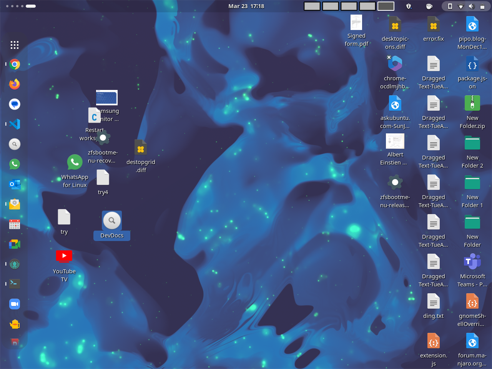

# Gtk4/libadwaita DING Desktop Icons New Generation


<p style="text-align: center;">
    <a href="https://extensions.gnome.org/extension/5263/gtk4-desktop-icons-ng-ding/" style="margin-left: 20px">
        
    </a>
</p>

## What is it?

Gtk4 Desktop Icons NG is an extension and a program together for the GNOME Shell that renders icons on the desktop. It is a fork from DING.

Desktop Icons NG (DING) by Sergio Costas itself is a fork/rewrite of the official 'Desktop Icons' extension, originally by Carlos Soriano.

This new Gtk4 extension was originally submitted upstream to the DING project as a merge request. It was not merged for quite some time with development continuing on both branches simultaneously. The branches started diverging significantly, and further, the new commit's in the original DING branch were not easily adaptable to changes already made in this gtk4 branch. That made it very difficult to rebase and merge all the new changes to the original branch. A mutual decision was therefore made to continue independent development of both branches. Important bug fixes from branches are still back ported and forward-ported between them. Therefore there are two extensions available, the classic DING that uses Gtk 3, and this newer fork based on Gtk 4 and libadwaita.

This fork of DING is ported to use the Gtk4 toolkit, and now has been ported to libadwaita. This, and the original DING can both be installed together, but only one can be activated at a time in the extension Manager. They use different install directories and GSettings schemas, therefore preferences set in one will not carrry through to the other. This is to avoid trampling on the stable branch and isolate errors from this branch.

Other than using the Gtk4 toolkit, and now libadwaita, it has in addition, several new features, fixes and enhancements.

The new web-widget layer can optionally launch helper backends defined per widget via `widget.json`. `HtmlWidgetHostWithBackend` spawns those commands directly from the widget bundle and exchanges newline-delimited JSON so widgets can render data produced by applications written in any language. This gives widget authors the power to integrate local system information or custom services well beyond what WebKit alone can access, so treat backend-enabled widgets like local applications and install only from trusted sources.

### UPDATE April 2025

Application was rewritten, cleaned up and restructured completely and several new classes added for cleaner mantainance.

### UPDATE October 2025

Uses Libretranslate to automatically translate into multiple languages.

### UPDATE Web Widget Layer December 2025

- Added a desktop web-widget layer like KDE desklets for Gnome Desktop: HTML widgets run in isolated WebKit WebViews (shared WebContext/UCM, jailed `ding-widget://` scheme) with per-monitor layers you can toggle above/below icons.
- Widgets support preferences via `widget.json` `prefs` paths (any subdirectory) and per-instance config (overwrites on save).
- As with any web content, widgets carry the same security considerations as a web page; read the security sections in the widget docs for details.
- The widget runtime is initialized lazily: if no widgets are enabled or instantiated, no WebKit processes are started, no additional resources are used, and there is no added attack surface beyond normal DING operation.
- Documentation: [Desktop_Widgets.md](Desktop_Widgets.md), [Widget_API.md](Widget_API.md), [Widget_CSP_Profiles.md](Widget_CSP_Profiles.md).

## Security

- **Backend-enabled widgets run native code.** If a widget declares a `backend` in `widget.json`, the host will spawn that command with the user’s privileges and pipe JSON over stdin/stdout. That process can read local files, access hardware, and reach the network outside the WebKit sandbox or CSP rules. Review widget bundles before installation and only deploy ones you trust as much as other desktop applications.
- **Per-widget isolation is at the UI layer, not the OS layer.** Widgets share the same user account and session; a malicious widget (or backend) can interfere with others.
- **Prefer least privilege.** Keep backend binaries small, audited, and limited to the capabilities they truly need. Forward only sanitized data between WebView and backend.
- **See** [Widget_API.md](Widget_API.md#htmlwidgethostwithbackend-json-protocol) **for protocol details and additional guidance.**

## Features and Fixes

New Features and fixes are listed in [FEATURES.md](https://gitlab.com/smedius/desktop-icons-ng/-/blob/main/FEATURES.md?ref_type=heads) in this folder.


## Issues

All issues are tracked on the GitLab web site. Please do a search through closed issues as well.

All known important issues are listed in [ISSUES.md](https://gitlab.com/smedius/desktop-icons-ng/-/blob/main/ISSUES.md?ref_type=heads) in this folder. 

## Requirements

* GNOME Shell >= 40
* Nautilus >= 3.38
* File-roller >= 3.38 or Gnome AutoAr (including gir1.2 files)
* Desktop folder already created
* GJS (Nix OS specifically needs this installed separately)
* GIR files for cairo and poppler are needed as well to render thumbnails locally. This should be available by default.
* For X11 xprop should be installed and executable, will work even without it, however things will work better and be more seamless without emulation if it is available.

## Installation

<p style="text-align: left;">
    <a href="https://extensions.gnome.org/extension/5263/gtk4-desktop-icons-ng-ding/" style="margin-left: 20px">
        
    </a>
</p>
<p style="text-align: left;">
The extension can be installed from [extensions.gnome.org](https://extensions.gnome.org/extension/5263/gtk4-desktop-icons-ng-ding/).
</p>

This should work out of the box for <b><u>Debian, Fedora, SUSE, Arch, Manjaro and most other distributions</b></u>

<p style="text-align: left;">
For <b><u>Arch Linux</b></u>, (and if needed, <b><u>Manjaro</b></u>), it is available in AUR [here](https://aur.archlinux.org/packages/gnome-shell-extension-gtk4-desktop-icons-ng). A pre-built package is available in downloads. Default install from extensions.gnome.org should also work.
</p>
<p style="text-align: left;">
<b><u>Manjaro</b></u> Gnome desktop has this as a default installed desktop icons extension. A native maintained build is available in the Manjaro Repository that can be installed directly with pacman and other tools. [Download](https://software.manjaro.org/package/gnome-shell-extension-gtk4-desktop-icons-ng) from Manjaro Community Repository is available. Default install from extensions.gnome.org should also work as well. There is a pre-buil package in Downloads.
</p>

For <b><u>Nix OS</b></u>, please see additional manual installation instructions in the section below.

<b><u>Fedora</b></u> - a prebuilt rpm is in the Downloads subdir for system install. Manual system and local installs with meson should work as well. The script make-rpm.sh in the scripts subdirectory will generate the spec and new rpm from source, edit script for VERSION or set it in the enviorenment.

<b><u>Debian</b></u> - a prebuild deb packages are available in Downloads subdirectory for download and direct install. This will install the extension in the sytem folders for all users. A manual local or system install from a git clone with meson is also possible. Install from extensions.gnome.org is probably the simplest way- this only does a local install for the user. make-deb.sh script in the scripts folder will generate a dpkg from current source, edit VERSION in script or set in enviornment.

<b><u>Ubuntu</b></u> See Debian for prebuilt deb package, works for Ubuntu as well. Otherwise requires manual installation, see instructions, a system installation is preferred to render thumbnails properly. Direct download from gnome extensions is unlikely to work properly.

For <b><u>Slackware Linux</b></u>, it is available in GFS [here](https://reddoglinux.ddns.net/linux/gnome/46.x/source/extensions/gnome-shell-extension-desktop-icons-ng/). Default install from extensions.gnome.org should also work.

## Manual installation

A prebuilt zip file is available in Downloads, unzip in .local/share/gnome-shell/extensions.

SORCE LOCAL INSTALL

The easiest way of installing DING is to run the `scripts/local_install.sh` script from the source directory (after changing directory to the source directory). The script assumes that it is being called from the base of the source directory. It performs the build steps specified in the next sections. It installs in the local home directory of the user.

If there are special steps to build and install the extension and app on your distribution, please submit an MR to this Readme.md to help other users on the same distribution. Some NIX Os users were very helpful in doing that. Also, local_install.sh in the scripts directory does read /etc/lsb-release, and any variables set there are imported into the script. Any variations necessary to install the extension and app on a particular distribution can then be easily coded, based on those variables, at the end of the script (See the Ubuntu example there already). I will be happy to include all changes necessary for your distribution in that script. Please submit an MR for that.

SOURCE SYSTEM INSTALL

`scripts/system-install.sh` is included for system wide installation. Again, execute from base of the source directory. It performs the meson setup and ninja build/install steps detailed in a following section. This will also install an AppArmor profile for the gtk4-ding in the system /usr location and restarts apparmor. Super user privilges will be required. This does allow userns for gtk4-ding, see ISSUES.md

<b><u>Ubuntu</b></u>

UBUNTU SYSTEM INSTALL

By default, Ubuntu does not allow userns privileges. Only apparmor rules in Ubuntu, can grant userns to specefied programs. These default rules are not defined for bwrap binary, Bubblewrap. This does not allow gnome-desktop library thumbnailFacotry to make thumbnails, and errors are logged. Gtk4-ding bypasses this by creating thumbnails for common image formats and pdf files - dependencies include gdkpixbuf, cairo and poppler. However, other xdg-thumbnailers installed on the system, for example appimage, ffmpgeg, audio, files etc will not work to render thumbnails through the gnome-desktop library.

Gtk4-ding will however, not write failure thumbnails, allowing other apps with appropriate AppArmor permissions like Gnome Files to render thumbnails if the desktop is opened in Gnome Files. These thumbnails will be displayed by gtk4-ding, if available.

A properly functioning version of apparmor-profiles that contains a new bwrap profile is still in the noble-proposed pocket. This should allow thumbnailing even for local installs. You can enable it by following the steps of this [wiki](https://wiki.ubuntu.com/Testing/EnableProposed).

See ISSUES.md for more information with app-armor.

System wide install for all users recommended as detailed in Manual install above, as Ubuntu has apparmor and userns restrictions enabled by default. The system install will install a apparmor policy for gtk4-ding allowing userns. This allows full functionality. See manual build and install with meson below or manual install with `scripts/system-install.sh`. Apparmor issue is detailed in ISSUES.md.

UBUNTU LOCAL INSTALL

If you are not interested in displaying thumbnails, local install works. If you disable apparmor, local install works with full functionality. A properly functioning version of apparmor-profiles that contains a new bwrap profile is still in the noble-proposed pocket. you can enable it by following the steps of this [wiki](https://wiki.ubuntu.com/Testing/EnableProposed).

In Ubuntu Jammy and later, the Ubuntu session is locked and only the default Ubuntu extensions run. Ubuntu runs it's own Desktop Icon Extension which is based on the old Gtk3 branch. Therefore, locally installing the extension from extensions.gnome.org will not work directly. The local install script provided in the repository bypasses this and installs this as a manually installed local extension. The default Desktop Icons extension that ships with Ubuntu then needs to be deactivated, and this newly installed one activated. It shows up on top as a user installed extension in extension manager.

The other method to update to this newest version in Ubuntu is to install the "gnome-session" package using apt or other native tools. This enables the use of a standard, unlocked, non Ubuntu, gnome shell session. In that session install the following extensions from extensions.gnome.org:

* This Extension
* Dash to dock extension
* Appindicator and KstatusNotifierItem support extensions

That will recreate a desktop experience similar to the original Ubuntu desktop, but with the most recent versions of the extensions, and without the default Ubuntu Desktop Icons Extension. The session is also unlocked for other non Ubuntu extensions, so any other extensions can be easily installed using extension manager.

<b><u>Nix OS</b></u>

Manual Fix to enable extension (tested in NixOS 23.05, GNOME 44.2, gtk4-ding extension version 38). We need to add the following in the configs:

Install gjs-

```
environment.systemPackages = with pkgs; [
  gjs
  gdk-pixbuf 
  imagemagick # For converting jpg to png 
];
```
Expose schema of nautilus-


```
services.xserver.desktopManager.gnome.extraGSettingsOverridePackages = with pkgs; [
  gnome.nautilus
  #gnome.mutter # should not be needed
  #gtk4 # should not be needed
];
```

To create a thumbnailer for odt, unpack it using unzip. These files are just zip files with a special structure. The thumbnail should always be in the same directory and  have the same filename.

``` 
  (
  pkgs.writeTextFile {
    # For the Thumbnailer use unzip!
    # The name can be anything, it's just the name of the derivation in the nix store
      name = "odt-thumbnailer";
    # This is the important part, the path under which this will be installed
      destination = "/share/thumbnailers/odt.thumbnailer";
    # The contents of your thumbnailer, don't forget to specify the full path to executables
      text = ''
          [Thumbnailer Entry]
          Exec=sh -c "${pkgs.unzip}/bin/unzip -p %i Thumbnails/thumbnail.png > %o"
          MimeType=application/vnd.oasis.opendocument.text;
      '';
    }
  )

``` 
The same goes for docx files, only they only provide a jpg so you must convert to png8. In this solution, imagemagick does the trick.

``` 
  (
  pkgs.writeTextFile {
    # For the Thumbnailer use unzip!
    # The name can be anything, it's just the name of the derivation in the nix store
      name = "docx-thumb";
    # This is the important part, the path under which this will be installed
      destination = "/share/thumbnailers/doc.thumbnailer";
    # The contents of your thumbnailer, don't forget to specify the full path to executables
      text = ''
          [Thumbnailer Entry]
          Exec=sh -c "${pkgs.unzip}/bin/unzip -p %i word/media/image1.jpeg | magick - -thumbnail x%s png8:- > %o "
          MimeType=application/vnd.openxmlformats-officedocument.wordprocessingml.document;
      '';
    }
  )
  ```
  
You may need to clear your thumbnail cache before proceeding! 

$ rm -rf ~/.cache/thumbnails/
  
Logout and log back in. Enable the extension manually. For some reason, home-manager configs cannot enable the extension using dconf.settings.

## Build with Meson

The project uses a build system called [Meson](https://mesonbuild.com/). You can install in most Linux distributions as "meson". You also need "ninja" and xgettext.

It's possible to read more information in the Meson docs to tweak the configuration if needed.

For a regular use and local development these are the steps to build the project and install it:

```bash
meson setup --prefix=$HOME/.local/ ./ .build
ninja -C .build install
```

It is strongly recommended to delete the destination folder ($HOME/.local/share/gnome-shell/extensions/gtk4-ding@smedius.gitlab.com) before doing this, to ensure that no old data is kept. It is also recommended to delete the local .build folder after the build is finished to clean up.

For system install:

```bash
meson setup ./ .build
ninja -C .build install
```

meson will prompt for superuser privileges for system install.

## Installing with Puppet

If you want to install it in several machines using puppet, you must first create an installation folder in your local machine using:

```bash
mkdir install_folder
meson --prefix=`pwd`/install_folder --localedir=share/locale .build
ninja -C .build install
rm -f install_folder/share/glib-2.0/schemas/gschemas.compiled
rm -rf .build
```

The content of the `install_folder` needs to be copied to the destination computers at /usr install folder. After doing that, run `sudo glib-compile-schemas /usr/share/glib-2.0/schemas` in each of the installed computers to update the schemas for that system.

## Export extension ZIP file for extensions.gnome.org or manual install of the extension folder

To create a ZIP file with the extension, just run:

```bash
./scripts/export-zip.sh
```

This will create the zip file `gtk4-ding@smedius.gitlab.com.zip` of the extension, following the publishing rules at extensions.gnome.org. A pre-built zip is available in Downloads, unzip in ~/.local/share/gnome-shell/extensions to just install manually.

## Contributing

Fixes are welcome. Please post fixes and new ideas with an MR at GitLab. Post all issues there as well. Posting issues at org.gnome.extensions, in the reviews of the extension helps no one, those issues are not tracked, and unlikely fixed.

There are ESLint rules in the repository, if able, please run ESLint on all contributions so that they follow GJS/Gnome guidelines. The ESLint.json is in the repository. The eslint-gjs.yml and eslint-shell.yml files are in the lint folder of the repository.

**Internal architecture, integration with other extensions, debugging**

The internal architechture and integration with other extensions, as well as debugging is discussed in [DEBUGGING.md](https://gitlab.com/smedius/desktop-icons-ng/-/blob/main/DEBUGGING.md?ref_type=heads) in this folder.

**Translations**

It is 2025, Machine Translation(MT) and LLM's are pretty good at translating. I have decided to leverage MT to translate all strings in the program into as many languages as supported by free tools to make the app useful to users in multiple languages.  The project uses gettext/ngetext, there are PO/POT files in the repository.

The project uses [LibreTranslate](https://libretranslate.org) to translate into all supported languages. Libretranslate is installed as a git sub-repository. The script po-autofill.js does the main job. The script generate-po.sh starts a docker container running libretranslate and then calls po-autofill.js, the docker container is killed at the end of the run. The script will not touch manually translated, confirmed strings, it only operates on fuzzy or manual-translation flagged strings.

The upside is most strings should be translated, needing less time and effort from users to complete than manual translation process. Most translation strings should appear, there should be a very few marked fuzzy.

The downside is that a lot of strings may have machine translation errors...

Corrections and new translations are welcome,you can help translate Gtk4 Desktop Icons NG on [Hosted Weblate](https://hosted.weblate.org/projects/gtk4-desktop-icons-ng/gtk4-ding-pot/). Translations are only accepted from that web site, it is crowd sourced. Also direct translations accepted to PO/POT files have broken the app and extension in the past and sometimes do not merge cleanly, the Weblate web sites creates clean PO/POT files that don't break gtk4-ding and merge without problems. If manually translating, remove both the manual translation "MT: Libretranslate" comment, as well as the machine-translated flag, otherwise the script will autogenerate the flag if the comment is present. This is because msmerge removes the manual-translation flag and marks strings fuzzy as it does not recognize the flag, in which case translations may not show up.
<p style="text-align: center;">
<a href="https://hosted.weblate.org/engage/gtk4-desktop-icons-ng/">

</a></p>
<p style="text-align: center;">
<a href="https://hosted.weblate.org/engage/gtk4-desktop-icons-ng/">

</a>
</p>

## Source code and contacting the author

For the Gtk4 Desktop Icons NG (This repository)-

Sundeep Mediratta  
<https://gitlab.com/smedius/desktop-icons-ng>  
smedius@gmail.com

Sergio Costas is the author for the Original Desktop Icons NG. His project and contact information is here, however any errors in the Gtk4-Desktop
Icons are all mine, please do not spam him with problems from my fork.

Sergio Costas  
<https://gitlab.com/rastersoft/desktop-icons-ng>  
rastersoft@gmail.com
